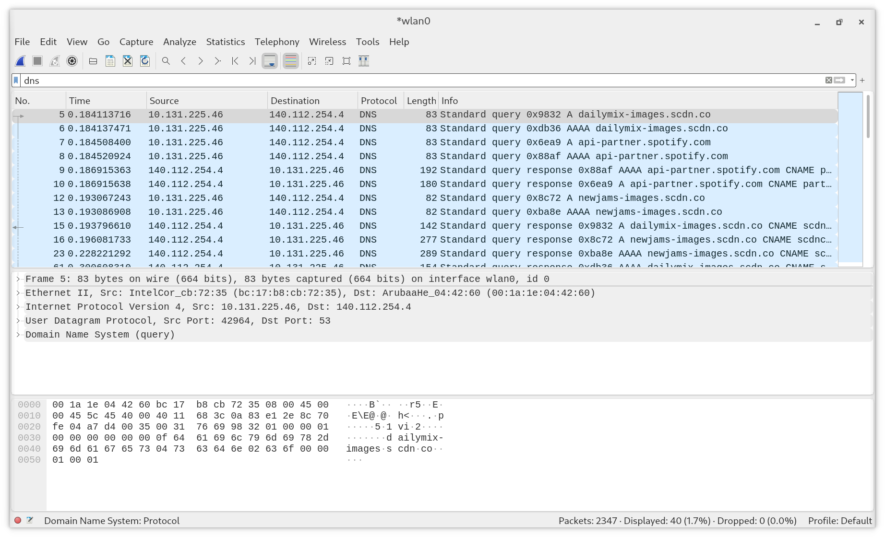
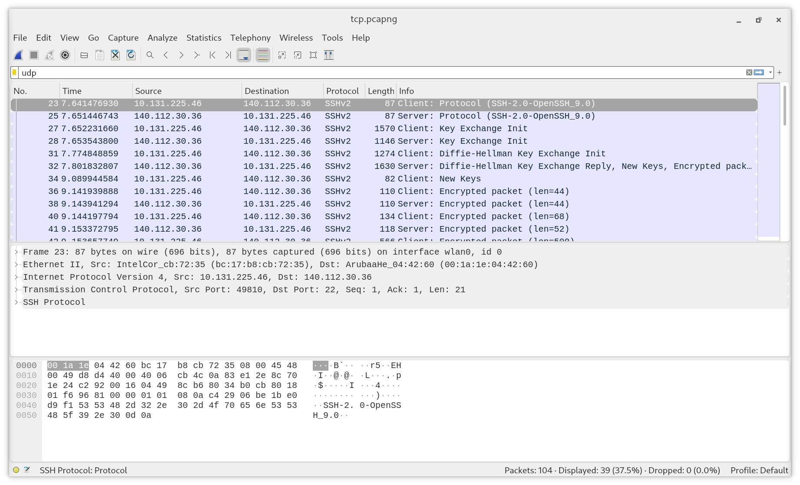
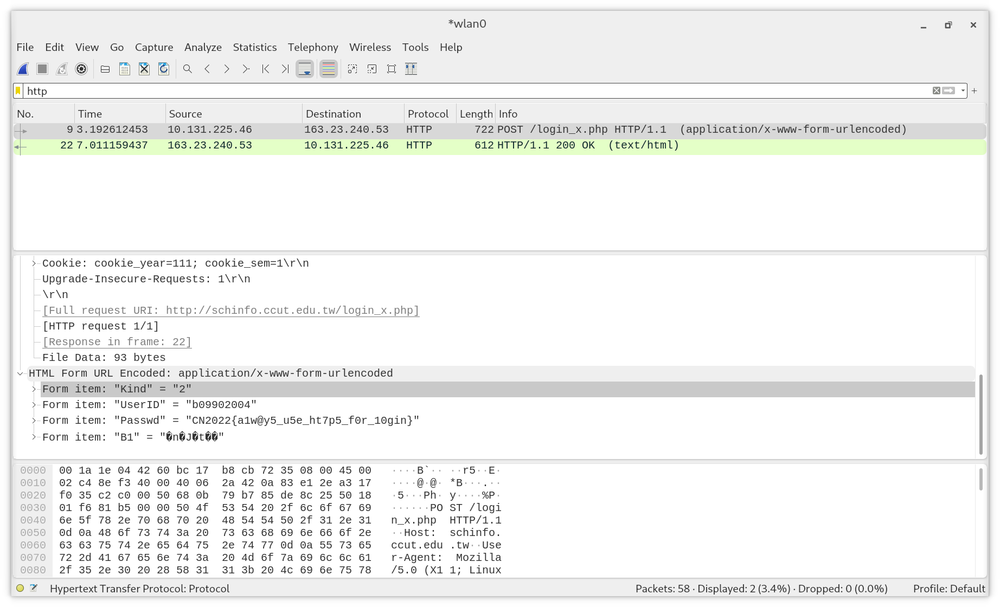
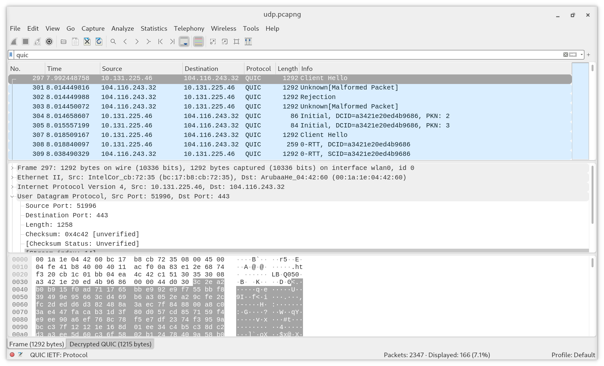

# HW1

b09902004 資工三 郭懷元

## UDP Packets

- Server address: `140.112.254.4`
- Service: DNS (Domain Name System)
- Port number used: `53` on server side, `42964` on client side

## TCP Packets

- SSH server: `linux5.csie.ntu.edu.tw` at `140.112.30.36`
- SSH server port: `22`
- My machine used private IP address in the tcp packets, because the subnet `10.0.0.0/8` is reserved for private network in IPv4, and my source ip address is `10.131.225.46`

## TCP & UDP Comparison

### Same fields

- Source port and destination port
- Checksum

### Different fields

- Header Length (only in TCP)
- Sequence number (only in TCP)
- Acknowledgement number (only in TCP)

## Plaintext Password in Packets

- Website: [中州科技大學校園網路資訊系統](http://schinfo.ccut.edu.tw/login.php)
- If an attacker can capture packets going through their campus's router, then any user of this website that is connected to the router would have their passwords leaked.

## Other Discovories

> Refs:
> - https://en.wikipedia.org/wiki/QUIC
> - https://en.wikipedia.org/wiki/HTTP/3

I found a protocol called "QUIC" that I hadn't heard of. It's a relatively new transport layer protocol running on top of UDP. It aims to improve performance of web apps that uses TCP now.

QUIC is used in the newly proposed HTTP/3. Previous versions of HTTP uses TCP as the transport layer protocol.
