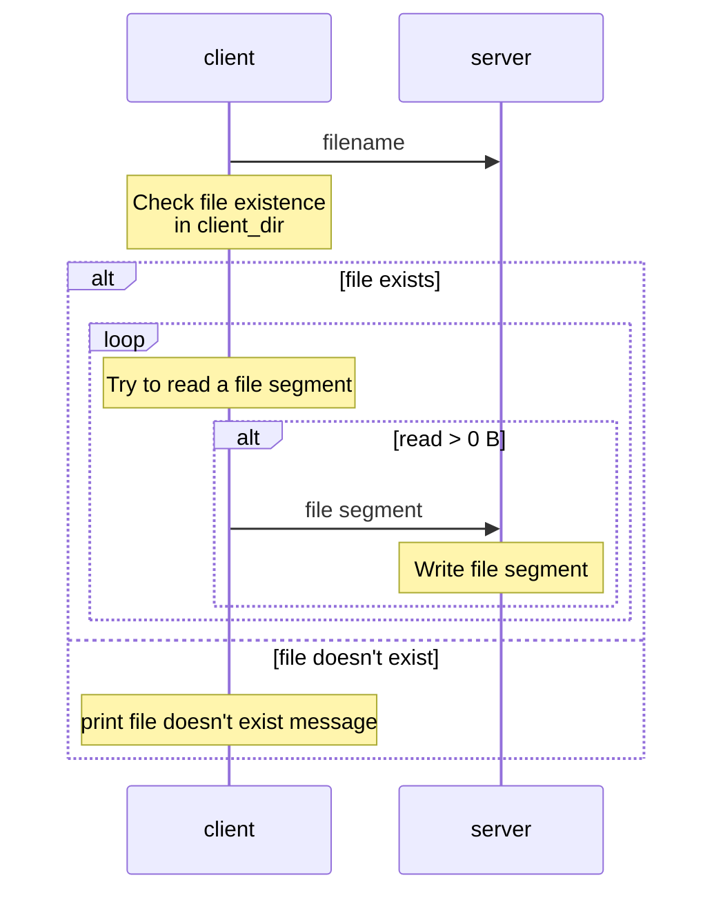
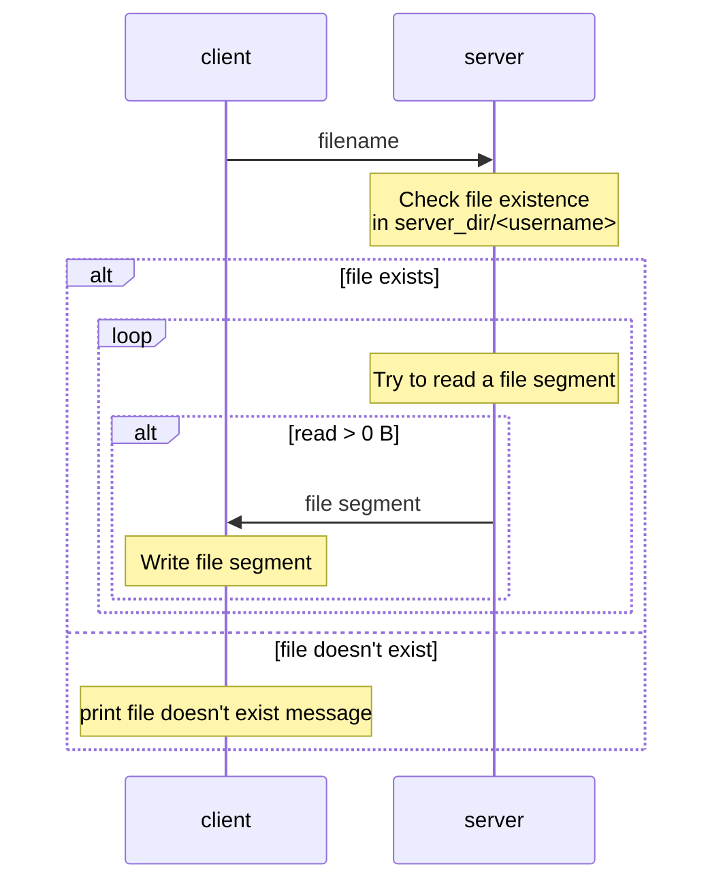
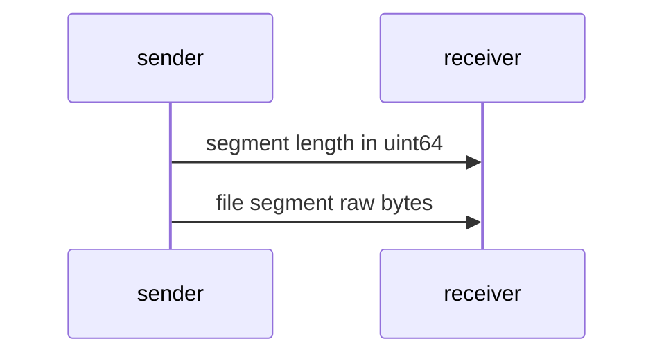

# CN HW2 Report

## File transferring workflow

### Notations

"File segment" is like a "block" of file contents, with a designed size limit of 1 MiB.

### Workflow of `put <filename>`

On alternative paths (e.g. if read more than 0 bytes), a "control message" is also sent, in order to indicate which path we are taking.

### Workflow of `get <filename>`

On alternative paths (e.g. if read more than 0 bytes), a "control message" is also sent, in order to indicate which path we are taking.

### Details on file segment transferring

A `uint64` number is packed into a `char` array in a little-endian way.

## Video streaming workflow

## What is SIGPIPE? Is it possible that SIGPIPE is sent to your process? If so, how do you handle it?

SIGPIPE is sent when the other end breaks the connection, and the default handler for SIGPIPE will end the process.

I used `send()` with `MSG_NOSIGNAL` flag to avoid generating SIGPIPE, as I implemented IO multiplexing with pthreads, and it's basically impossible to determine which thread the SIGPIPE is for. I used the return value from `send()` to know if an error occurs, then gracefully close the socket to end the connection.

## Is blocking I/O equal to synchronized I/O? Please give some examples to explain it.

