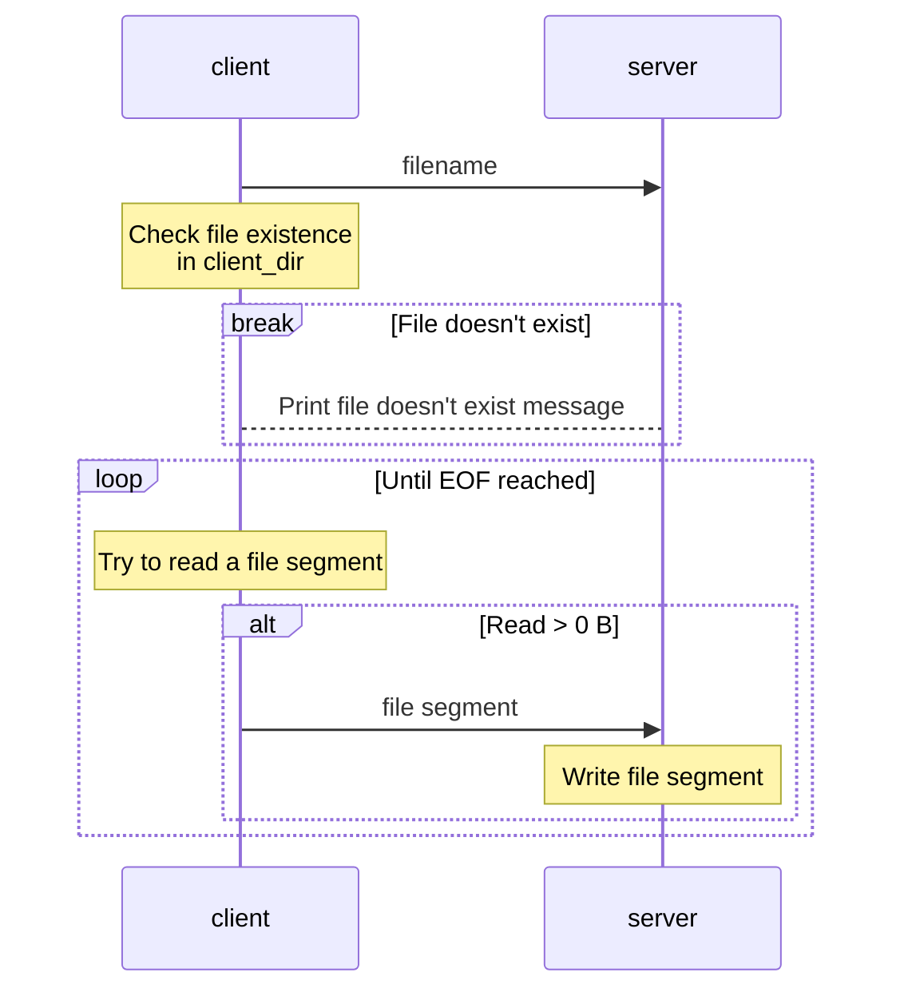
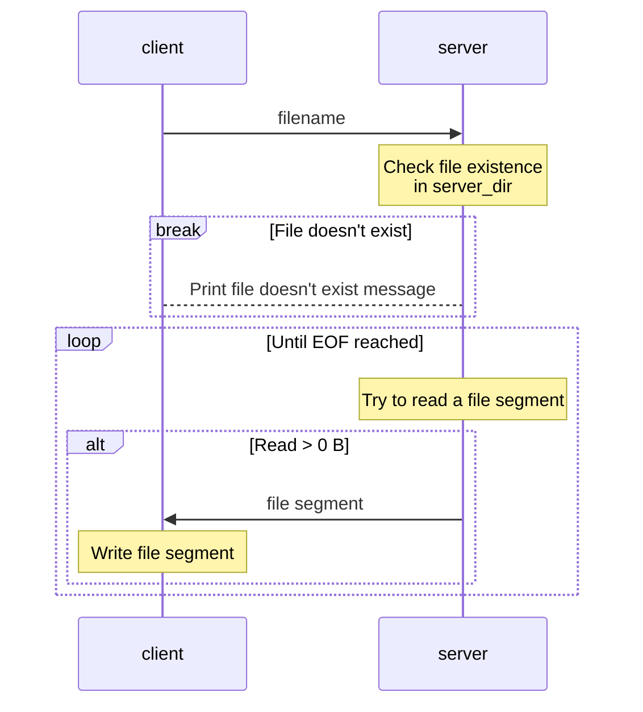
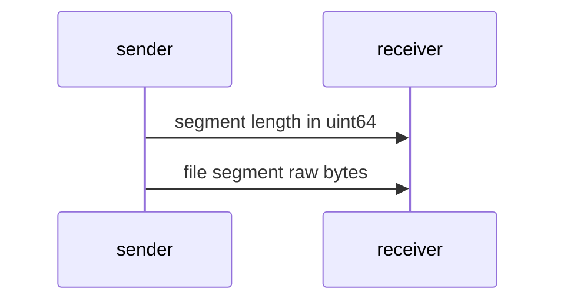
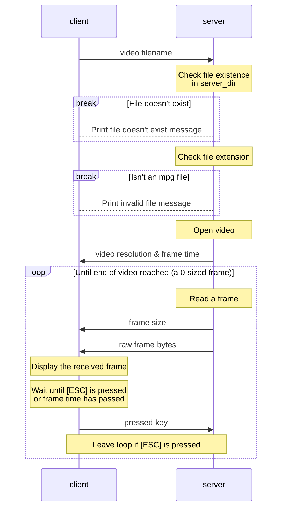
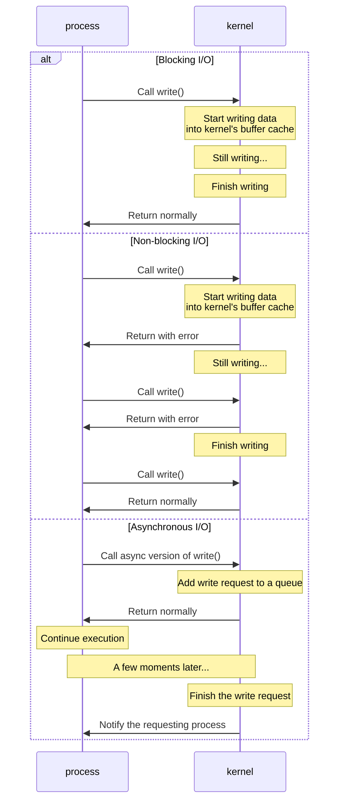

# CN HW2 Report

b09902004 資工三 郭懷元

## File transferring workflow

### Notations

"File segment" is like a "block" of file contents, with a designed size limit of 1 MiB.

### Workflow of `put <filename>`

On alternative paths (e.g. if read more than 0 bytes), a "control message" is also sent in order to indicate which path we are taking.

### Workflow of `get <filename>`

On alternative paths, a "control message" is also sent in order to indicate which path we are taking.

### Details on file segment transferring

A `uint64` number is packed into a `char` array in a little-endian way.

## Video streaming workflow

On alternative paths, a "control message" is also sent in order to indicate which path we are taking.

## What is SIGPIPE? Is it possible that SIGPIPE is sent to your process? If so, how do you handle it?

SIGPIPE is sent when the other end breaks the connection, and the default handler for SIGPIPE will end the process.

I used `send()` with `MSG_NOSIGNAL` flag to avoid generating SIGPIPE, as I implemented IO multiplexing with pthreads, and it's basically impossible to determine which thread the SIGPIPE is for. I used the return value from `send()` to know if an error occurs, then gracefully close the socket to end the connection.

## Is blocking I/O equal to synchronized I/O? Please give some examples to explain it.

> Refs:
> 
> - [POSIX.1-2017 Definitions](https://pubs.opengroup.org/onlinepubs/9699919799/basedefs/V1_chap03.html)
> - [Synchronizing I/O (The GNU C Library)](https://www.gnu.org/software/libc/manual/html_node/Synchronizing-I_002fO.html)
> - [淺談I/O Model. 前言 | by Carl | Medium](https://medium.com/@clu1022/%E6%B7%BA%E8%AB%87i-o-model-32da09c619e6)

Blocking I/O doesn't equal to synchronized I/O. In fact, at least in Linux, most I/O operations are probably not synchronized. A blocking I/O operation only guarantees the kernel to finish writing to the kernel's **buffer cache**. A synchronized I/O operation requires the data to be written onto the **physical device**.

For example, calling `write()` in blocking-mode means the data will be written to the buffer cache, but it might not be written onto the hard drive for some time, or until calls to functions like `sync()`.

Another concept is "synchronous/asynchronous", which can be explained through the following diagram.

