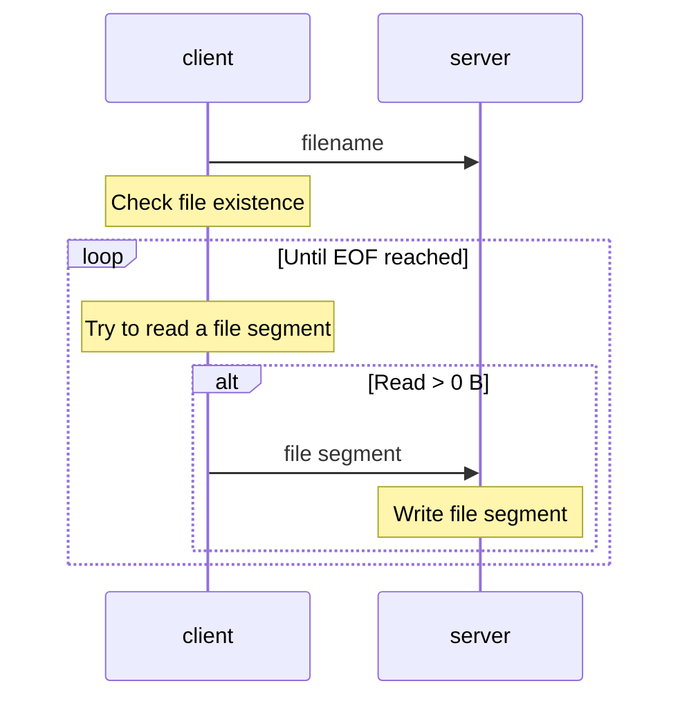
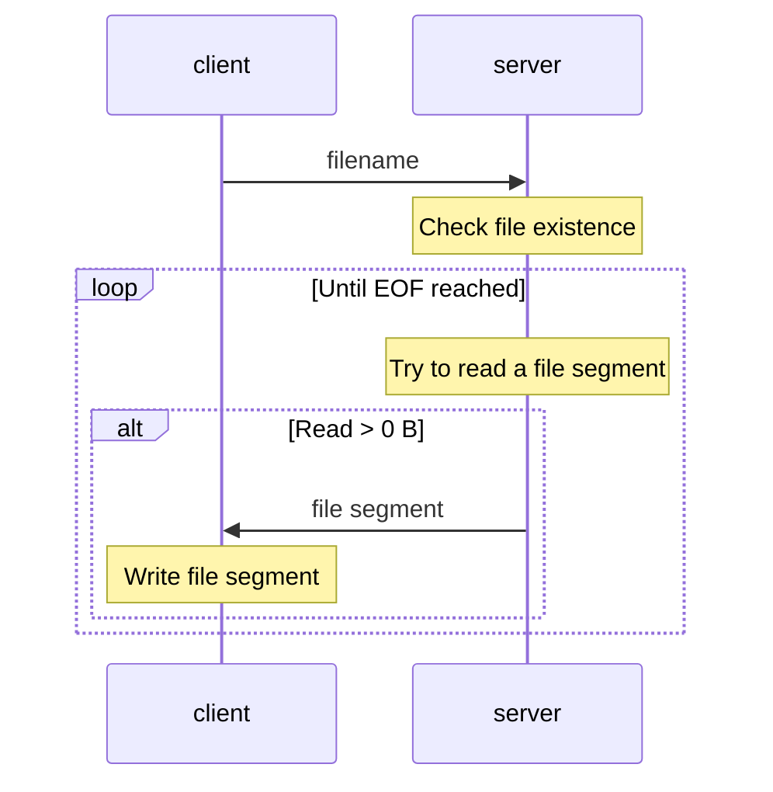
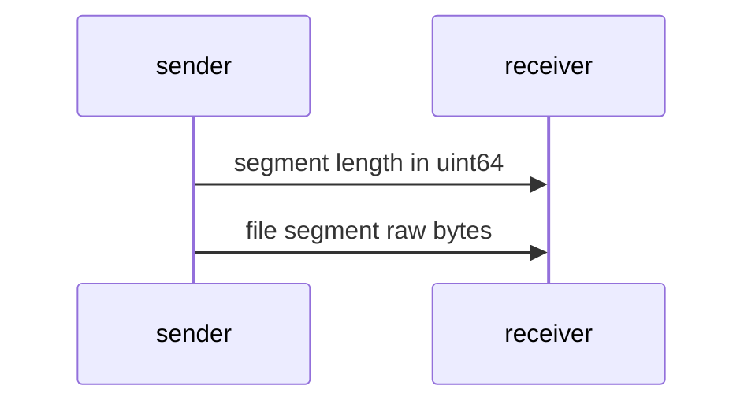
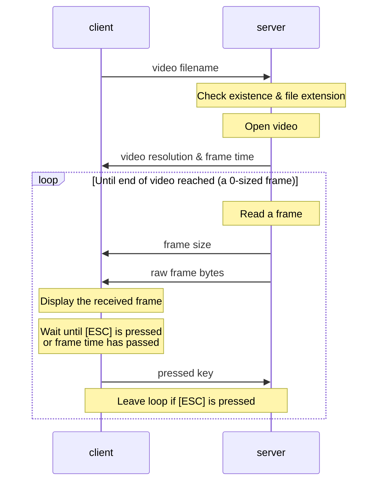
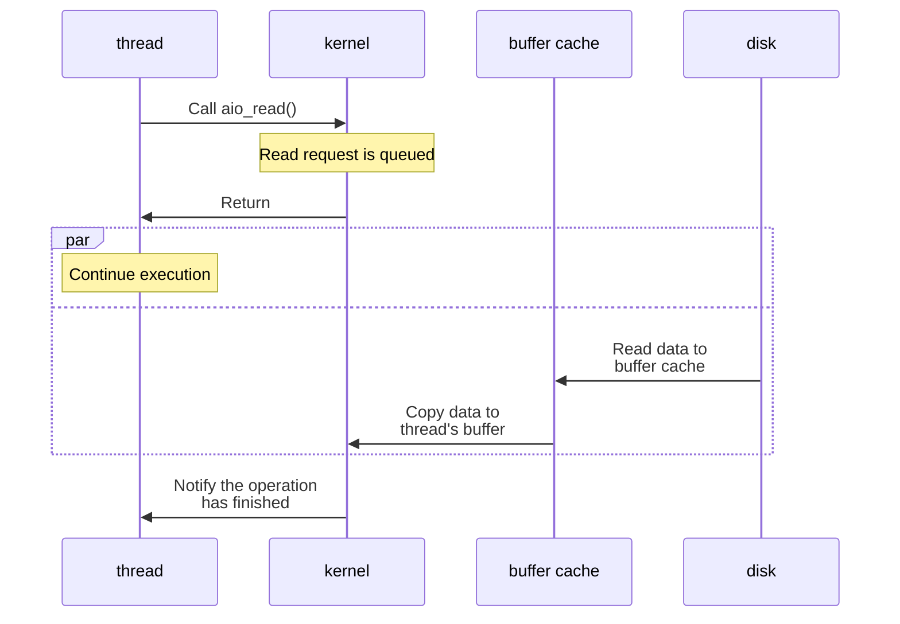
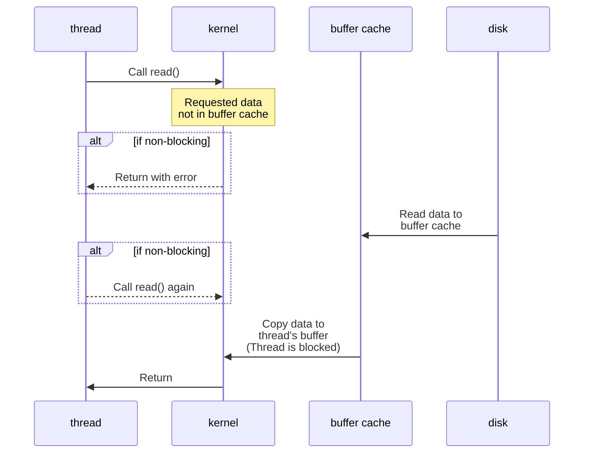

# CN HW2 Report

b09902004 資工三 郭懷元

## File transferring workflow

### Notations

"File segment" is like a "block" of file contents, with a designed size limit of 1 MiB.

### Workflow of `put <filename>`

On alternative paths (e.g. if read more than 0 bytes), a "control message" is also sent in order to indicate which path we are taking.

### Workflow of `get <filename>`

On alternative paths, a "control message" is also sent in order to indicate which path we are taking.

### Details on file segment transferring

A `uint64` number is packed into a `char` array in a little-endian way.

---

## Video streaming workflow

On alternative paths, a "control message" is also sent in order to indicate which path we are taking.

---

## What is SIGPIPE? Is it possible that SIGPIPE is sent to your process? If so, how do you handle it?

SIGPIPE is sent when the other end breaks the connection, and the default handler for SIGPIPE will end the process.

I used `send()` with `MSG_NOSIGNAL` flag to avoid generating SIGPIPE, as I implemented IO multiplexing with pthreads, and it's basically impossible to determine which thread the SIGPIPE is for. I used the return value from `send()` to know if an error occurs, then gracefully close the socket to end the connection.

---

## Is blocking I/O equal to synchronized I/O? Please give some examples to explain it.

> Refs:
> 
> - [POSIX.1-2017 Definitions](https://pubs.opengroup.org/onlinepubs/9699919799/basedefs/V1_chap03.html)
> - [Synchronizing I/O (The GNU C Library)](https://www.gnu.org/software/libc/manual/html_node/Synchronizing-I_002fO.html)
> - [淺談I/O Model. 前言 | by Carl | Medium](https://medium.com/@clu1022/%E6%B7%BA%E8%AB%87i-o-model-32da09c619e6)
>
> Note: In this section, blocking, non-blocking, synchronized, synchronous, and asynchronous are used with the definition in POSIX.

### Blocking & Synchronized I/O

Blocking I/O doesn't equal to synchronized I/O. *Blocking* only implies that the function won't return until the request has been fulfilled, but *synchronized* requires guarantee of data integrity.

For example in normal file outputs on UNIX & UNIX-like OS's, *synchronized* typically means the data is written onto the **physical device**, and can be enforced using `sync()` for the whole filesystem. *blocking* means the data is written to the kernel's **buffer cache**, and can be enabled on a per-file-descriptor basis.

In the case of TCP socket I/O, calling `send()` in blocking mode doesn't mean that the data is immediately sent. The kernel will usually wait until enough data is in its TCP buffer, then send the packet out, to reduce the header overhead of many tiny TCP packets.

### Synchronous & Asynchronous I/O

Another concept is synchronous and asynchronous, which can be explained through the following diagrams.

#### Asynchronous I/O

I/O operation won't cause the user thread to be blocked. Their execution is decoupled.

#### Synchronous I/O

A non-blocking but synchronous I/O call can still block the user thread.

---
