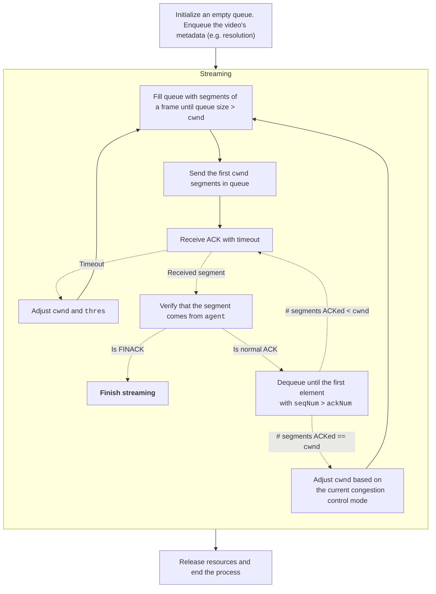
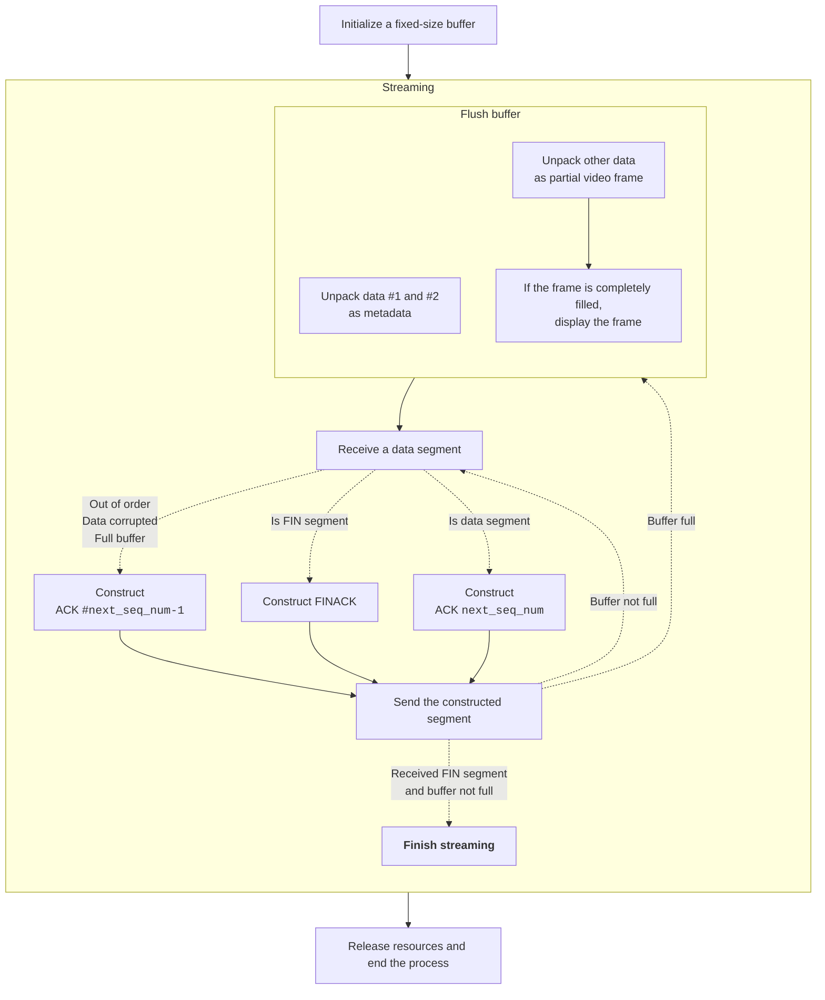
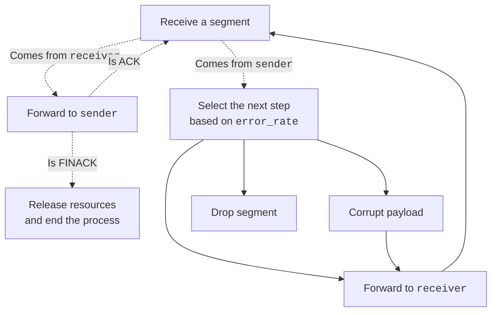

# CN HW3 Report

b09902004 資工三 郭懷元

## Notation

- `cwnd`: Current transmit window size
- `thres`: Threshold of switching from "slow start" to "congestion avoidance"
- `next_seq_num`: The next sequence number that `receiver` is expecting

## Sender

---

## Receiver

---

## Agent

---